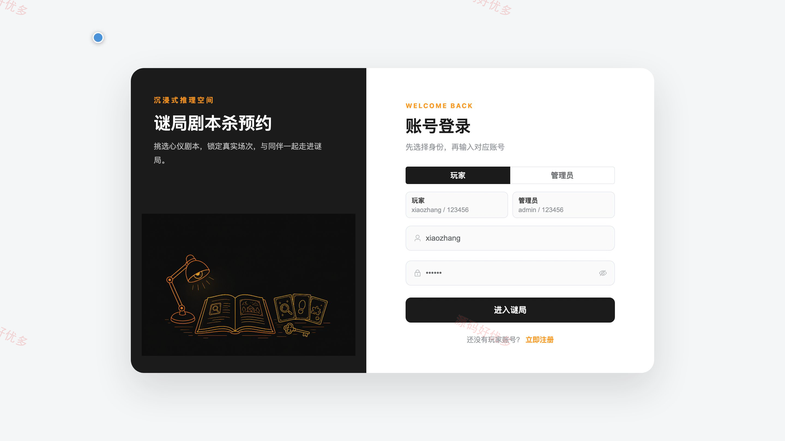
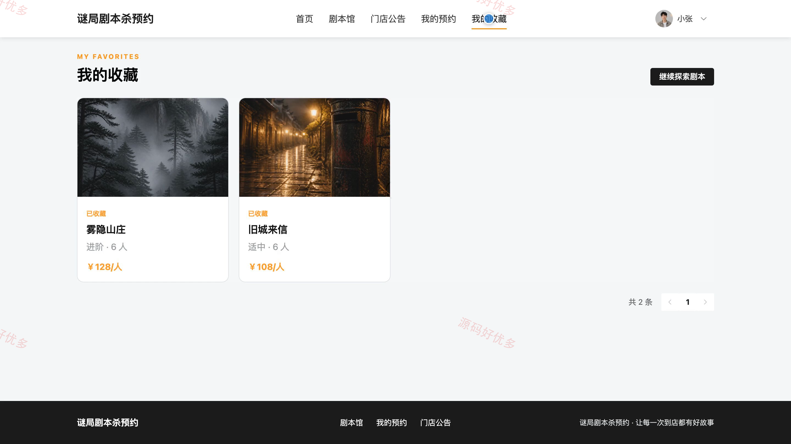
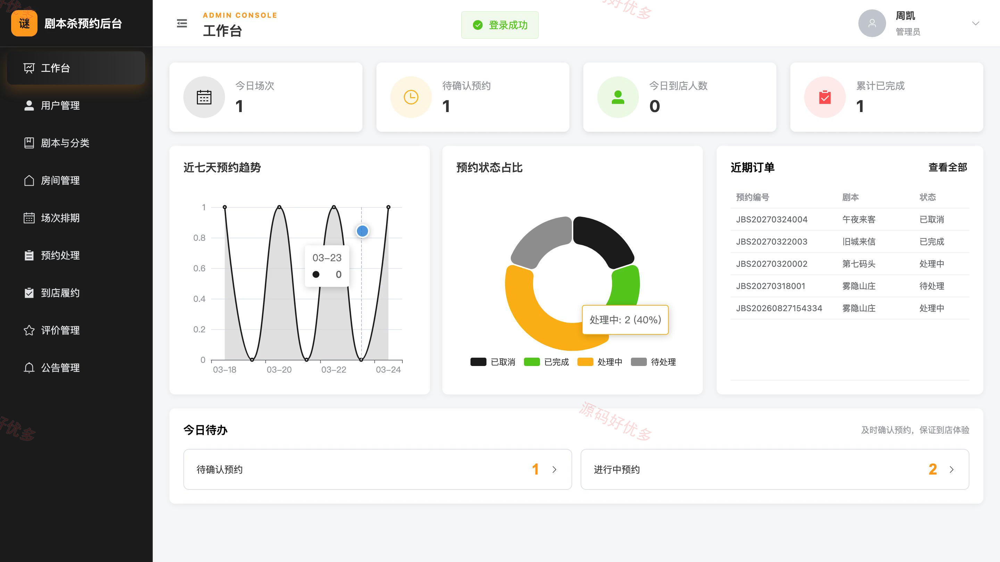
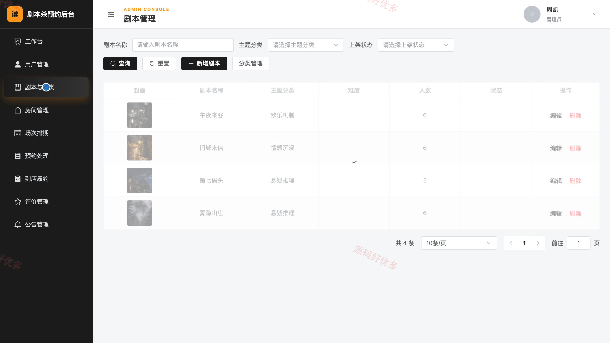
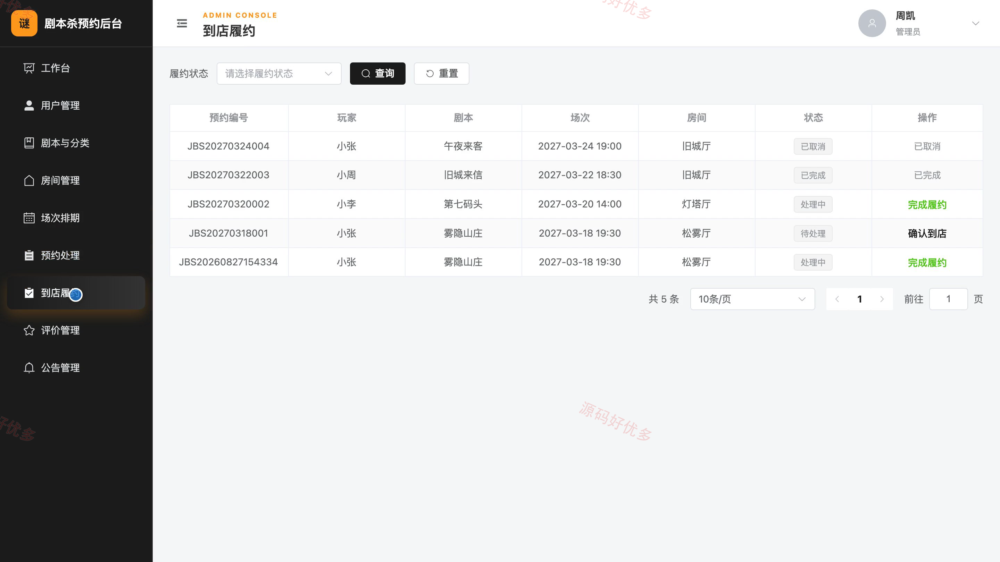
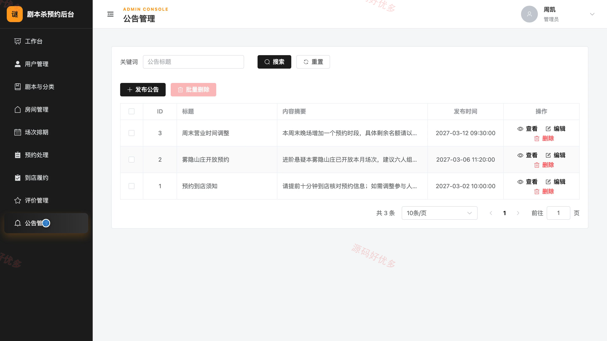

## 源码问题查看主页咨询

### 一、关键词
剧本杀预约、剧本馆、门店场次预订、密室娱乐预约、桌游活动报名

### 二、作品包含
源码+数据库+万字设计文档+PPT+全套环境和工具资源+本地部署教程

### 三、项目技术
前端技术： Html、Css、Js、Vue3.4、Element-Plus
后端技术：Java、SpringBoot3.2.0、MyBatis-Plus

### 四、运行环境（以下版本亲测，其他版本兼容性请自行测试）
开发工具：IDEA/eclipse + VSCODE

数据库：MySQL5.7+（共13张表）

数据库管理工具：Navicat10以上版本

环境配置软件： JDK17 + Maven3.6.3

前端Nodejs：20.19.5

浏览器：谷歌浏览器

### 五、项目介绍
项目编号：bs085A

剧本杀预约系统面向玩家与门店管理员，围绕剧本浏览、场次查询、在线预约、收藏评价和门店履约管理提供完整业务流程，并通过排期、房间容量与预约状态协同提升门店接待效率。

角色：玩家、管理员

玩家功能：账号注册与登录、剧本浏览与筛选、剧本详情及场次查询、在线预约与取消、预约记录查看、剧本收藏、完成场次评价、个人资料与密码维护。

管理员功能：门店数据工作台、玩家账号管理、剧本与分类管理、房间管理、场次排期、预约处理、到店履约管理、评价与公告管理。

### 六、运行截图

